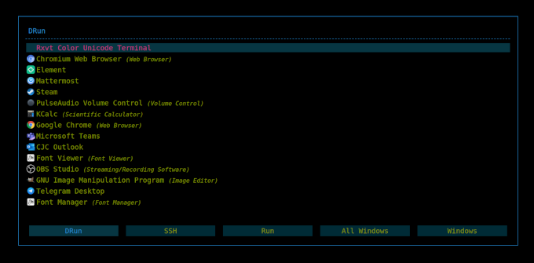

# rofi-solarized-dark-darker

My rofi configuration for usage with i3wm. Based on solarized but using black instead of gray, therefore darker. ;-)



# Installation

## Install rofi

On Debian/Ubuntu:

```
apt-get update
apt-get install rofi
```

## Clone this repo

```
git clone https://github.com/christopher-john-czettel/rofi-solarized-dark-darker/ ~/.config/rofi
```

## Add i3 bindings

Edit `~/.config/i3/config`:

```
# rofi launcher/switcher bidings 
bindsym Mod1+Tab exec rofi -show windowcd
bindsym $mod+Tab exec rofi -show window
bindsym $mod+d exec rofi -show drun
bindsym $mod+r exec rofi -show run
bindsym $mod+Shift+d exec rofi -show ssh
bindsym $mod+space exec rofi -show combi
```
# Usage / Shortcuts

With the above bindings added, following shortcuts are available (<kbd>Meta</kbd> probably is your "<kbd>Windows</kbd>" ;-)):

| Shortcut      | Rofi mode     | Description |
| ------------- | ------------- |  ------------- |
| <kbd>Alt</kbd> + <kbd>Tab</kbd> | windowcd      | Shows/searched all windows on current desktop |
| <kbd>Meta</kbd> + <kbd>Tab</kbd> | window        | Shows/searches all windows on *all* desktops  |
| <kbd>Meta</kbd> + <kbd>d</kbd> | drun        | Shows/searches drun-style menu |
| <kbd>Meta</kbd> + <kbd>r</kbd> | run        | Shows/searches executable binaries |
| <kbd>Meta</kbd> + <kbd>Shift</kbd> + <kbd>d</kbd> | ssh        | Shows/searches your ssh hosts from .ssh/config  |
| <kbd>Meta</kbd> + <kbd>Space</kbd> | combi        | Shows/searches all of the above at once  |


While rofi is open, you can switch between modes with <kbd>Alt</kbd> + <kbd>h</kbd> and <kbd>Alt</kbd> + <kbd>l</kbd>.

Use <kbd>Ctrl</bkd> + <kbd>n</kbd> or <kbd>Ctrl</bkd> + <kbd>p</kbd> to switch menu items.

Then <kbd>Tab</kbd> or <kbd>Return</kbd> to run/switch to selection.

# Author

- [Christopher John CZETTEL](https://github.com/christopher-john-czettel/) (https://christopher-czettel.net)

# License

- GPLv3
